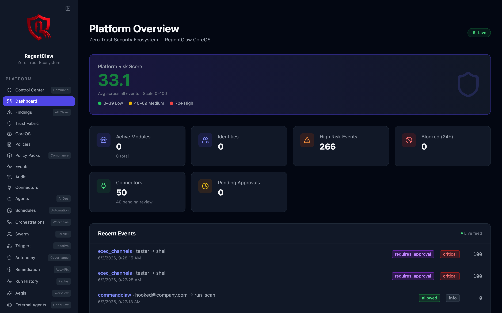
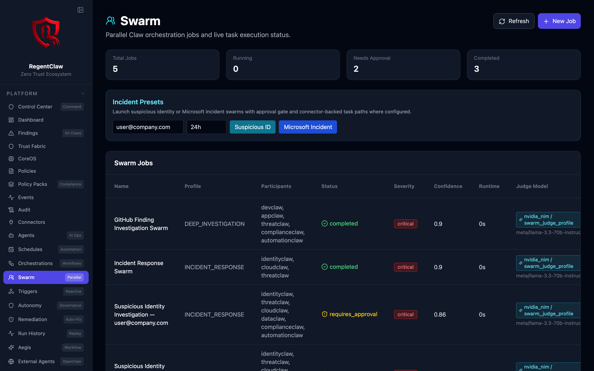
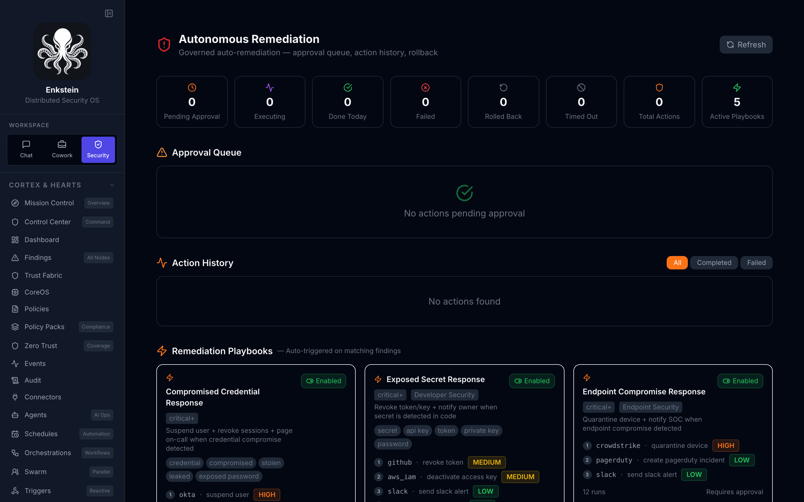
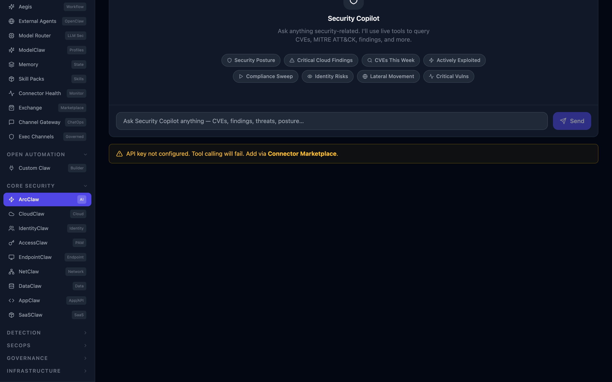

> [!IMPORTANT]
> **Enkstein architecture working copy.** This repository is an independent, compatibility-first evolution of RegentClaw. RegentClaw remains untouched. The working architecture introduces a Cortex, Three Hearts, Security Arms, Capability Nodes, Skills, Connectors, Reflexes, a peer Plexus, and Regeneration. See [Enkstein Plexus Architecture](docs/marcellus-architecture.md). Existing RegentClaw names and routes remain available while the new runtime is implemented and verified.

<p align="center">
  
</p>

<h1 align="center">Enkstein Architecture Lab</h1>

<p align="center">Distributed, organism-inspired security automation with Zero Trust enforcement across every Cortex, Heart, Arm, Node, and action.</p>

<p align="center">
  
  
  
  
</p>

> [!NOTE]
> **Project status — early preview (v0.x).** Enkstein is a self-hosted, open-source architecture working copy under active development.
> It runs on **realistic simulated findings out of the box** — connect your own API credentials to enable live integrations.
> Security hardening is ongoing and the platform has **not yet had an independent third-party audit**. It is built for
> evaluation, self-hosted testing, and community feedback — not yet for unmonitored production or multi-tenant SaaS use.
> See the honest [OWASP Agentic self-assessment](https://wcoreiron-rgb.github.io/marcellus/owasp-agentic.html) and
> [Maturity Matrix](docs/maturity-matrix.md) for exactly what's shipped vs. in progress.

## Enkstein Distributed Runtime

Enkstein `0.5.1` provides three governed runtime paths on top of the compatibility platform:

| Layer | Shipped behavior | Maturity |
|---|---|---|
| **Plexus** | Tenant-scoped peer mailboxes, Fernet-encrypted payloads, Ed25519-signed envelopes, TTL, idempotency, acknowledgements, and Trust Fabric decisions | Shipped |
| **Reflexes** | Typed conditions, owner/tenant binding, authority ceilings, cooldowns, hourly budgets, Trust Fabric and Ring Policy evaluation, and independent approval for action Reflexes | Shipped |
| **Regeneration** | Signed encrypted checkpoints, manifest/state verification, secret rejection, quarantine, six-stage restoration, health verification, and approval-gated rejoin | Partial |

The Regeneration implementation recreates the persisted logical Capability Node runtime. A host, process, container, or remote worker adapter is still required before it can replace an external runtime instance.

The operator console is available at [`/marcellus`](http://localhost:3000/marcellus). Runtime endpoints are under `/api/v1/marcellus/plexus`, `/api/v1/marcellus/reflexes`, and `/api/v1/marcellus/regeneration`. See [Enkstein Plexus Architecture](docs/marcellus-architecture.md) for endpoint and security details.

### Persistent Missions and governed Memory

Security mode now opens with **Mission Control**, where an operator can create,
pause, resume, and run persistent security Missions. Each Mission launches the
existing bounded-parallel Swarm runtime on a manual, hourly, six-hour, daily,
or weekly cadence. Mission tasks have a fixed `read`, `analyze`, and `recommend`
authority ceiling; they cannot silently gain remediation privileges.

Mission objectives, observations, and overnight briefs are encrypted at rest;
Swarm records hold only a tenant-bound Mission reference and integrity digest.
Completed runs produce tenant-scoped memory proposals that are scanned for
sensitive content and prompt-injection risk, evaluated by Trust Fabric, and
held for an independent approve/reject decision. Only approved observations are
loaded into later tasks for that same tenant and Mission. The 12-hour overnight
brief summarizes active Missions, material changes, decisions needed, running
Arms, recent Reflex metadata, blocked activity, and Security Twin health without
copying raw Reflex event bodies into the report.

The API is under `/api/v1/marcellus/missions`; see
[Enkstein Architecture](docs/marcellus-architecture.md#persistent-missions-and-governed-memory)
for the route list and current limitations.

### Governed AI workspace

The `/marcellus` console now presents three first-class work modes:

- **Chat** for general governed conversation.
- **Cowork** for file-assisted planning, analysis, writing, and review.
- **Security** for the Cortex, Three Hearts, Arms, Plexus, Reflex, and Regeneration controls.

Chat and Cowork call `POST /api/v1/modelclaw/gateway`. The Cortex Gateway scans
the complete conversation, redacts detected sensitive values, audits prompt
injection risk, obtains a Trust Fabric decision for each Brain, invokes only an
allowed source, scans the output, and writes model-call audit metadata. Users
can select automatic routing, Codex or Claude subscription bridges, a configured
NVIDIA NIM or Gemini API profile, a local Brain, or multi-Brain consensus. Auto
routing is mode-aware, records its candidate order and selection reason, and
falls through only to a policy-approved available Brain. `restricted` and
`top_secret` automatic requests are forced to the local profile.

Model Cortex hardens the profile, audit, direct
Brain, consensus, and compatibility model routes are tenant-bound; profile
mutation requires an operator identity; and Multi-Brain calls use bounded
per-tenant/per-source concurrency with safe timeouts.

Version `0.5.1` keeps a paired Browser Companion marked ready while it is
submitting, streaming, or completing a long provider turn, and routes workspace
SSE through a dedicated streaming proxy rather than the generic API rewrite.
This prevents an active signed-in ChatGPT, Claude, or Gemini tab from being
reported as disconnected or a healthy multi-minute response from being marked
stalled merely because it is busy producing an answer.

For Cowork implementation requests, every answering Brain is an advisor, not a
filesystem authority. When Browser Companion, Hybrid-local, or other supported
profile output returns an architecture or ordinary code answer without a safe
project-relative manifest, Enkstein sends a bounded copy to its dedicated local
Qwen file author. The author receives its own output budget and can recover
complete file entries even if its final JSON fence is cut off. Trust Fabric then
governs proposal or Auto-apply writes into the operator-selected project root.
A planning response is never represented as local execution.

Browser Brain handoffs are capped to a compact, continuity-preserving context
instead of replaying an entire conversation into a provider message editor.
Cowork accepts the strict Enkstein manifest as well as the safe equivalent JSON
forms emitted by local models (for example `type`/`file_path`), then applies the
same tenant-scoped path validation, Trust Fabric decision, and approved-folder
write boundary before any local file changes.

The Chat, Cowork, and Security workspaces are separate mounted state
containers. Their URL hash, browser history, and remembered mode stay aligned;
Chat never loads project state, while Cowork scopes conversations and encrypted
artifacts to the selected tenant-owned Project. Conversation create, open,
rename, archive, and project move operations update immediately.

Assistant responses in Chat and Cowork render as safe GitHub-flavored Markdown —
headings, paragraphs, lists, tables, links (opened with `rel="noopener noreferrer"`),
inline code, blockquotes, and citations — with raw HTML never enabled and dangerous
URL protocols stripped. Fenced code blocks show a language label, light/dark styling,
exact whitespace with horizontal scrolling for long PowerShell/Python/Terraform, and
an accessible Copy button. Change proposals, Codex approvals, and terminal
failed/timeout/interrupted turns render as compact operational blocks rather than raw
JSON; a terminal turn offers **Retry** (replays the preserved message as a fresh turn,
which is safe because a failed turn rolls back server-side) and **Continue** (returns
the message to the composer), preserving the draft and conversation without duplicate
submission. Each assistant reply carries a compact provenance record —
source/provider/model, runtime group, policy outcome, latency, confidence,
input/output redaction, and fallback reason.
For Cowork turns that propose, apply, skip, or block local project changes, that
same durable record now includes an expandable **Files changed** ledger with
the relative path, create/update/delete operation, and final outcome. The
ledger is content-free, survives reopening the conversation, and never turns a
planning response into claimed execution.

### Brain runtime groups

Chat, Cowork, Security, and Model Cortex consensus expose three governed groups:

- **Local** permits only the approved Ollama/local-profile boundary and fails
  closed when no capable local model is ready.
- **Hybrid** tries approved local Brains first, then policy-approved CLI/API
  sources in ordered fallback sequence.
- **Cloud** permits approved subscription CLI/API sources and never adds a
  desktop or browser session implicitly.

`restricted` and `top_secret` adaptive requests are pinned to Local before the
selected group is evaluated. Trust Fabric evaluates Brain readiness discovery
and every attempted source. Failed, unavailable, and policy-denied votes remain
visible but never count toward consensus.

Runtime-group selection is currently carried on every request and remembered
locally by the console. It is **not yet persisted per conversation or Project**:
the existing database schema has no compatible field and this release was not
authorized to add a migration. Tenant-owned role-route configuration for
persisted operator presets remains planned. `POST /api/v1/modelclaw/task-graph`
now executes an explicit acyclic graph of bounded specialist roles through the
existing Cortex Gateway. It validates any supplied Project against the resolved
tenant and requester, applies Trust Fabric to graph admission, peer evidence,
and every ordered provider fallback, and uses isolated database sessions for at
most three parallel nodes. Timeouts and dependency skipping are bounded; caller
cancellation stops local waiting, but provider-side cancellation is not claimed.
Results record actual provider attempts plus model, policy, latency, requester,
specialist, workspace, and dependency-evidence attribution.

For Chat/Cowork turns and native Codex operations, effective classification is
the highest of the request, conversation, Project, and every included active
artifact. The covered runtime paths deny external Brains for `restricted` and
`top_secret` data and fail closed when no approved local Brain is available.
This is a tested application-layer boundary for those paths, not a blanket
certification of every legacy connector or data flow in the compatibility
platform.

Chat and Cowork now persist encrypted, tenant-scoped conversation history.
Cowork adds named Projects, encrypted versioned text artifacts, searchable
history, persistent project-file context, conversation organization, and a
real desktop folder bridge. A macOS operator can explicitly grant one local
folder to a project; Enkstein receives an opaque grant, synchronizes bounded
text files, and can create, edit, rename, move, or recoverably trash files in
that folder. Browser Cowork retains an import-copy fallback. Raw host paths are
never exposed to the container or web UI. Content is path-bounded, DLP-scanned,
treated as untrusted context, and every mutation is tenant-scoped and authorized
through Trust Fabric. The
**Investigate** action creates an approval-gated Security
Swarm from an encrypted conversation reference and digest. Bounded context is
decrypted and redacted only in memory when Security tasks execute.

The Swarm Judge uses the same gateway with `swarm_judge_profile`. Existing Arc
tool sessions retain their specialized tool adapter and their established DLP
and Trust Fabric checks; migrating tool-session execution into the shared
gateway is tracked separately so tool capability is not silently reduced.

### Governed Brain Bridges and consensus

Enkstein `0.2.15` can use supported model runtimes already authenticated on
the desktop without copying subscription tokens into Docker:

- **Codex Subscription Bridge:** detects the official Codex runtime, verifies
  that it is authenticated with ChatGPT, and runs ephemeral, read-only,
  reasoning-only invocations. Desktop Cowork Agent tools instead use one
  resumable official `codex app-server` thread per governed project/conversation
  scope, with streamed events, one-shot command/file approvals, deny-only
  permission expansion, cancellation, and interrupted-session recovery.
- **Claude Agent SDK Bridge:** detects an authenticated Claude Code/Agent SDK
  host runtime and invokes it with tools disabled. It remains unavailable until
  the official host runtime is installed and authenticated.
- **Desktop Session Bridge:** can use a compatible visible ChatGPT or Claude
  macOS app after explicit Accessibility permission and a live message-field
  compatibility check. Incompatible vendor builds fail closed.
- **Browser Session Bridge:** pairs the narrowly scoped Enkstein Browser
  Companion with visible signed-in ChatGPT, Claude, or Gemini tabs. It never
  reads cookies or account tokens and is selected explicitly rather than by
  silent automatic routing. Tenant-scoped conversation affinity reuses one
  provider tab per Enkstein chat instead of creating a new thread per turn.
- **Brain Consensus:** consults selected subscription, approved API, and local
  model profiles concurrently. Unavailable, policy-denied, failed, and
  simulated responses never count as votes.

Every invocation is evaluated by Trust Fabric, tenant/profile constraints are
rechecked, model output is rescanned and redacted, and call provenance is
written to the Model Cortex audit. The host bridge uses a random per-install
secret, accepts only local/private peers, and never returns vendor credentials.
It deliberately exposes no unrestricted terminal or tool execution path.

Endpoints include `GET /api/v1/modelclaw/brains/status`, `POST
/api/v1/modelclaw/brains/invoke`, `POST /api/v1/modelclaw/consensus`, and the
authenticated desktop/browser setup routes under `/api/v1/modelclaw/brains/`. See
[Brain Bridges](docs/brain-bridges.md) for setup, trust boundaries, and vendor
account limitations.

<p align="center">
  <a href="https://wcoreiron-rgb.github.io/marcellus/">
    
  </a>
  <a href="https://wcoreiron-rgb.github.io/marcellus/docs.html">
    
  </a>
  <a href="http://localhost:3000">
    
  </a>
</p>

<p align="center">
  <a href="https://github.com/wcoreiron-rgb/marcellus/projects">
    
  </a>
  <a href="https://github.com/wcoreiron-rgb/marcellus/issues/new?labels=bug&title=%5BBug%5D+">
    
  </a>
  <a href="https://github.com/wcoreiron-rgb/marcellus/issues/new?labels=enhancement&title=%5BFeature%5D+">
    
  </a>
  <a href="https://github.com/wcoreiron-rgb/marcellus/discussions">
    
  </a>
</p>

<p align="center">
  <a href="https://github.com/wcoreiron-rgb/marcellus/actions/workflows/ci.yml">
    
  </a>
  <a href="https://codecov.io/gh/wcoreiron-rgb/regentclaw">
    
  </a>
</p>

<p align="center"><strong>Full Documentation</strong></p>
<p align="center">
  <a href="https://wcoreiron-rgb.github.io/marcellus/">
    
  </a>
  <a href="https://wcoreiron-rgb.github.io/marcellus/docs.html#architecture">
    
  </a>
  <a href="https://wcoreiron-rgb.github.io/marcellus/changelog.html">
    
  </a>
</p>

<p align="center"><strong>Languages</strong></p>
<p align="center">
  
  
  
  
  
  
</p>

## What is RegentClaw?

**RegentClaw is AI-driven security automation with a Zero Trust governance layer baked into every action.**

Security teams today face a hard tradeoff:

- **Agent frameworks & raw LLM agents** (AutoGPT / LangChain-style) are *powerful but ungoverned* — they can call any tool, hit any API, and execute anything, with no policy layer, no risk scoring, and no audit trail. You would never point one at production.
- **Traditional SOAR platforms** are *governed but not intelligent* — rigid, pre-scripted playbooks that can't reason, correlate, or adapt to a novel incident.

RegentClaw collapses that tradeoff. The thesis is simple:

> **AI agents should investigate and act on security problems autonomously — but every action they take must be authorized, risk-scored, and fully auditable.** That's Zero Trust, applied to AI automation.

### How it works

1. **AI does the work, not just the talking.** A Security Copilot and parallel multi-agent **Swarms** investigate findings, query live CVE/MITRE/CISA data, correlate identity and cloud risk, and propose (or execute) remediations.
2. **The Trust Fabric governs every action.** Each tool call, credential access, and remediation passes through a central enforcement layer that evaluates policy, scores risk, enforces **execution rings** (privilege tiers), requires human approval for high-risk actions, and writes an **immutable audit log**. There are no escape hatches and no ungoverned execution paths.
3. **25 security domains out of the box.** From cloud posture and identity to endpoint, threat intel, and DevSec — plus AI-specific governance (prompt-injection detection, DLP) most platforms don't have at all.

**The problem it solves:** *How do I let AI agents actually do security work — not just chat about it — without handing them unbounded power over my environment?*

## Screenshots

<table>
  <tr>
    <td width="50%"><br/><sub><b>Platform Overview</b> — risk score, live event feed, module &amp; connector status across the Zero Trust CoreOS.</sub></td>
    <td width="50%"><br/><sub><b>Swarm Orchestration</b> — parallel multi-claw investigations with judge models, confidence scoring, and approval gates.</sub></td>
  </tr>
  <tr>
    <td width="50%"><br/><sub><b>Autonomous Remediation</b> — approval queue, action history with one-click rollback, and built-in response playbooks.</sub></td>
    <td width="50%"><br/><sub><b>Security Copilot (AI Security)</b> — AI agent with live tool calling for CVEs, MITRE ATT&amp;CK, findings, and posture.</sub></td>
  </tr>
</table>

> More views: [Trust Fabric](docs/screenshots/trust-fabric.png) · [Control Center](docs/screenshots/control-center.png) · [Connector Marketplace](docs/screenshots/connectors.png)

## How RegentClaw Compares

RegentClaw sits at the intersection of three tool categories — and is the only one that delivers all of it under one governed roof. Each category below has real strengths (shown honestly); the gap RegentClaw fills is **governance + intelligence + security-domain coverage together.**

| Capability | Raw LLM Agents<br/><sub>(AutoGPT-style)</sub> | Agent Frameworks<br/><sub>(LangChain etc.)</sub> | Traditional SOAR<br/><sub>(playbook engines)</sub> | **RegentClaw** |
|---|:---:|:---:|:---:|:---:|
| Autonomous AI investigation & reasoning | ✅ | ✅ | ❌ rigid scripts | ✅ Copilot + multi-agent swarms |
| Per-action policy enforcement | ❌ | ❌ build it yourself | ~ static rules | ✅ Trust Fabric on **every** action |
| Continuous risk scoring (action / session / device) | ❌ | ❌ | ~ | ✅ |
| Execution privilege isolation | ❌ | ❌ | ❌ | ✅ 4-tier ring policy |
| Human-in-the-loop approval gates | ❌ | ~ DIY | ✅ | ✅ dual-approval, self-approval blocked |
| Immutable audit of every agent action | ❌ | ❌ | ~ | ✅ |
| AI-specific governance (prompt injection, DLP) | ❌ | ❌ | ❌ | ✅ 12-vector AGT audit |
| Security domain coverage out of the box | ❌ | ❌ | ~ via connectors | ✅ 25 capability nodes |
| Governed multi-agent orchestration | ~ | ~ | ❌ | ✅ swarms w/ judge + approval |
| Self-hosted · bring-your-own-keys | ~ | ✅ | ~ | ✅ |

<sub>✅ native · ~ partial / depends on configuration · ❌ not available. Categories represent common tooling patterns, not specific vendors. This is a vendor self-assessment — see the [OWASP Agentic self-assessment](https://wcoreiron-rgb.github.io/marcellus/owasp-agentic.html) and [Maturity Matrix](docs/maturity-matrix.md) for evidence of what's shipped vs. in progress.</sub>

**In one line:** an agent framework gives you *capability*, a SOAR gives you *process*, RegentClaw gives you **autonomous capability that is governed by default.**

## Architecture

```
RegentClaw/
├── backend/           FastAPI — CoreOS, Trust Fabric, AI Security, Identity Security
├── frontend/          Next.js — Platform UI dashboard
├── docker-compose.yml Full local stack
```

## Security Compliance

RegentClaw maintains an honest, evidence-backed self-assessment against the **OWASP Top 10 for LLM/Agentic AI Applications (2025)**.

| Document | Format |
|---|---|
| [OWASP Evidence Matrix (Interactive)](https://wcoreiron-rgb.github.io/marcellus/owasp-agentic.html) | Interactive HTML |
| [LLM Top 10 Mapping (Markdown)](docs/owasp-agentic-mapping.md) | Markdown |
| [Agentic ASI Top 10 Mapping (Markdown)](docs/owasp-asi-mapping.md) | Markdown |
| [Platform Maturity Matrix (Markdown)](docs/maturity-matrix.md) | Markdown |
| [Production Deployment Guide](docs/production-deployment.md) | Markdown |

**Current posture (2026-05-31):**

| Category | Status |
|---|---|
| LLM01 Prompt Injection | Shipped — 12-vector AGT audit on every AI event |
| LLM02 Insecure Output Handling | Shipped — prompt scanning, model-output re-scan/redaction, and DLP scanning of provider-generated binary downloads (OOXML/ZIP members included) before any file is written |
| LLM03 Training Data Poisoning | N/A — uses provider APIs, no training pipeline |
| LLM04 Model Denial of Service | Shipped — auth and model-router per-IP limits, plus per-identity rate limiting on governed Cowork/Chat turn, stream, and research endpoints; token-budget quotas remain planned |
| LLM05 Supply-Chain Vulnerabilities | In Progress — encrypted credentials, pinned deps, AGT supply-chain scan + exchange checksum gate, CI SBOM + blocking dependency policy thresholds |
| LLM06 Sensitive Information Disclosure | Shipped — Fernet encryption, DLP scanner, masked credential hints |
| LLM07 Insecure Plugin Design | Partially Shipped — ring policy + SSRF protection shipped; OS sandbox not yet |
| LLM08 Excessive Agency | Shipped — 4-ring privilege isolation, dual-approval gates, self-approval blocked |
| LLM09 Overreliance | Shipped — override usage captured in routing audit, and lowering a detected data classification is refused without a recorded justification |
| LLM10 Model Theft | N/A — no hosted weights; API keys encrypted at rest |

> This is a vendor self-assessment. Independent audit recommended before compliance reliance.

Supply-chain policy gating supports a temporary time-boxed waiver baseline at `security/supply_chain_baseline.json` so CI blocks on net-new risk while legacy debt is being burned down.

Compliance Assurance now exposes a Trust Fabric-governed evidence bundle export at `POST /api/v1/complianceclaw/evidence/export`, including findings, compliance-relevant audit logs, framework rollups, and a SHA-256 chain-of-custody hash.

## Quick Start

### Download a release package

The easiest installation path is a versioned bundle from
[GitHub Releases](https://github.com/wcoreiron-rgb/marcellus/releases). Each
release includes `.tar.gz` and `.zip` self-hosted bundles, Python package
artifacts, and `SHA256SUMS` integrity checks.

```bash
tar -xzf marcellus-VERSION.tar.gz
cd marcellus-VERSION
./install.sh
```

The installer validates Docker Compose, creates a private `.env` with unique
random secrets, builds the containers, and starts Enkstein. It never
overwrites an existing `.env`. See [installation details](docs/installation.md).

### One-click desktop installers

GitHub Releases also provide native launchers:

- **macOS:** install `Enkstein-VERSION-macos.pkg`; setup creates
  `/Applications/Enkstein.app` and launches a native Intel/Apple Silicon
  desktop window after installation.
- **Windows x64:** run `Enkstein-VERSION-windows-x64-setup.exe`; setup creates
  Start Menu and optional desktop shortcuts and launches `Enkstein.exe`.

Both launchers start Docker Desktop when necessary, generate unique local
secrets, and start the Enkstein services. The macOS app displays startup
progress, waits for the Cortex and UI health checks, and embeds the governed UI
inside its own WebKit window instead of opening the browser. Docker Desktop is
still required, and the first launch can take several minutes while local
images build. Connector credentials are added afterward through the Connectors
UI and remain encrypted in persistent local volumes. See
[native installer details](docs/native-installers.md).

### Local owner authentication and background runtime

The first desktop launch requires creation of a local owner password and TOTP
enrollment with an RFC-compatible Authenticator application. Enkstein displays
the QR secret only during enrollment and returns ten one-time recovery codes.
Later owner sessions require both the password and current Authenticator code;
email-code viewer access remains optional after an Email/SMTP connector is
configured.

The operator console locks after 30 minutes without interaction. Locking,
closing, or quitting the console does not stop the Compose runtime: monitoring,
schedules, active Swarms, and policy-authorized Reflexes continue, while actions
that require human approval remain queued. On macOS, the menu-bar control can
reopen or lock the console. Authentication endpoints are under
`/api/v1/auth/owner/*`; TOTP secrets and recovery-code hashes are encrypted in
the persistent local secret volume.

### Prerequisites
- Docker + Docker Compose installed
- 4GB RAM available

### Run locally

```bash
cd RegentClaw
docker-compose up --build
```

Then open:
- **Frontend UI**: http://localhost:3000
- **API Docs**: http://localhost:8000/docs
- **Health check**: http://localhost:8000/health

The Docker frontend runs as a production Next.js server. The image builds the UI with `npm run build`, starts it with `npm run start`, and proxies browser `/api/v1/*` calls to `http://backend:8000` inside Docker.

### First steps after launch

1. Open http://localhost:3000/dashboard
2. Go to **Connectors** → click any connector → enter your own API credentials
   - Credentials are encrypted at rest (Fernet AES-128) and never stored in plaintext
   - Each deployment auto-generates its own encryption key in `backend/.secrets/` (gitignored)
3. Go to **Policies** → add preset policies (Block Shell Execution, etc.)
4. Go to **AI Security** → submit a test prompt (try including an API key to test detection)
5. Watch the **Events** and **Audit** log populate
6. Go to **Identity Security** → check identity inventory

> **Security note:** Never commit `backend/.secrets/` — it contains your encryption key and stored credentials. This directory is gitignored by default. Each deployer gets their own isolated key.

### Connecting your own tools

Every Capability Node module supports real integrations. Go to **Connectors** and add credentials for the tools you use:

| Category | Supported integrations |
|---|---|
| Cloud | AWS (Security Hub), Azure (Defender), GCP (Security Command Center) |
| Cloud posture | Prowler CLI (read-only AWS, Azure, GCP, Kubernetes, and GitHub checks) |
| Endpoint | CrowdStrike Falcon, Microsoft Defender for Endpoint, SentinelOne |
| Identity | Okta, Microsoft Entra ID, AWS IAM |
| AI/LLM | Anthropic, OpenAI, Azure OpenAI, Ollama (local) |
| Code | GitHub (secret scanning, code review) |
| Log/SIEM | Splunk |
| Custom | Any REST API via Custom Capability |

Without credentials, all modules run on realistic simulated findings so the platform is fully usable for demos and evaluation.

Every finding records a **data origin** so the two are never confused once you connect a real
connector. Findings are labelled `live` (returned by an authenticated provider, with the source
connector named), `simulated` (locally generated demonstration data), or `unknown`. An adapter
that supplies no origin is recorded as `unknown` rather than `live`, so nothing can be presented
as verified estate data by omission. Filter with `GET /api/v1/findings?data_origin=live`, or use
the data-origin filter in the Findings console.

Prowler ships inside the backend image in its own virtual environment, so its dependency tree cannot collide with
the backend's pinned requirements. Register the Prowler Cloud Posture connector, choose a provider, and run
Cloud Security. Enkstein invokes Prowler without a shell, passes cloud secrets through the child environment rather
than command arguments, caps execution time and output, and labels results with a stable Prowler control ID. A
missing executable or failed run is reported honestly; demonstration findings are not substituted for a failed scan.

### Zero Trust control plane

Enkstein measures posture against a control catalog of 1,426 controls: 324 from the NIST SP 800-53 Rev 5 OSCAL
catalog, 1,038 from Prowler's AWS/Azure/GCP/Kubernetes/GitHub checks, and 64 authored for Capability Nodes.
Controls are grouped by CISA Zero Trust Maturity Model pillar and retain their source, version, automation state,
and remediation metadata.

Each Security Arm carries its own tailored profile rather than sharing one flat pool, so its coverage percentage is
measured against controls it can actually produce evidence for. A control passes only when a collector ran and
returned no violation: silence is never success, demonstration data never produces a verdict, and stale evidence
downgrades to NOT ASSESSED. Failing controls propose the remediation they declare through the governed remediation
engine, which keeps its own risk classification and approval gate.

See [Zero Trust controls](docs/zero-trust-controls.md) for the full API surface and verdict rules.

### Which Capability Nodes return live data

Seven nodes call a provider API when a connector is configured: **Cloud Posture** (AWS Security
Hub, Azure Defender for Cloud, GCP SCC), **Endpoint** (CrowdStrike, Defender, SentinelOne),
**Developer Security** (GitHub), **Identity** and **Privileged Access** (Entra ID, Okta),
**Security Telemetry** (Splunk), and **AI Governance**.

The remaining nodes are connector-aware but not yet adapter-backed. Configuring a connector for
one of them does not empty it: it keeps showing demonstration findings with the `simulated`
badge and reports `"Connector configured, but no live adapter is available yet"` in the scan
response, so a configured-but-inert connector is never mistaken for a broken scan.

### Connecting Microsoft without an app registration

Entra ID, Azure, Defender, and Sentinel connectors support **interactive sign-in** using the
OAuth device authorization grant. Enkstein shows a code, you approve it once on Microsoft's own
sign-in page, and Enkstein receives a refresh token — no app registration and no client secret.
Access tokens renew automatically so scheduled scans keep working.

This is a documented provider flow, not browser-session reuse: no cookies, page automation, or
vendor session tokens are involved, and you can revoke the grant from Microsoft's consent screen
at any time. Device sign-in passes the same Trust Fabric policy gate as manual credential entry.

GitHub device sign-in requires your own OAuth app; set `GITHUB_OAUTH_CLIENT_ID` to enable it.
Every other connector continues to use credential configuration, because `client_credentials`
with a scoped app registration is the correct posture for unattended scanning.

## Use it from your terminal & editor

RegentClaw ships in three installable forms beyond the web platform. All three talk to your running RegentClaw server, so the **Trust Fabric governs every call** — policy, risk scoring, and audit apply server-side.

### ⚡ Add RegentClaw to Cursor in 30 seconds (MCP)

Let the AI agent in your editor call governed security tools — scan code for secrets, check posture, launch investigations.

```bash
pip install ./regentclaw_mcp-0.7.0-py3-none-any.whl
```

Add to `~/.cursor/mcp.json` (or your Claude Desktop / VS Code MCP config):

```json
{
  "mcpServers": {
    "regentclaw": {
      "command": "regentclaw-mcp",
      "env": { "REGENTCLAW_API_URL": "http://localhost:8000" }
    }
  }
}
```

Restart Cursor, then just ask:

> *"Scan the file I have open for hardcoded secrets."*
> *"What's my current security posture?"*
> *"Investigate suspicious identity activity for user@corp.com."*

Tools exposed: `scan_text_for_secrets` · `get_security_posture` · `list_findings` · `list_connectors` · `run_swarm_investigation` · `terraclaw_generate_secure_terraform` · `terraclaw_review_hcl` · `terraclaw_analyze_plan`. → [full MCP docs](mcp-server/README.md)

### 🖥️ CLI — drive the platform from your shell

```bash
pip install ./regentclaw_cli-0.7.0-py3-none-any.whl
export REGENTCLAW_API_URL=http://localhost:8000
regentclaw status dashboard
regentclaw connectors test okta
regentclaw evidence collect --framework soc2
```
→ [full CLI docs](cli/README.md)

### 🧩 Embed the governance core (no server)

Drop RegentClaw's enforcement primitives into your own scripts, agents, or pre-commit hooks — runs in-process, only depends on `cryptography`.

```bash
pip install ./regentclaw_core-0.7.0-py3-none-any.whl
```
```python
from regentclaw_core import classify_ring, evaluate_ring, scan_text, verify_package
```
→ [full core docs](regentclaw-core/README.md)

## API Reference

Full interactive docs at: http://localhost:8000/docs

Key endpoints:

| Method | Path | Description |
|--------|------|-------------|
| GET | /api/v1/dashboard | Platform stats |
| POST | /api/v1/arcclaw/events | Submit AI event for inspection |
| GET | /api/v1/arcclaw/stats | AI Security risk summary |
| GET | /api/v1/identityclaw/identities | Identity inventory |
| GET | /api/v1/identityclaw/orphaned | Orphaned identities |
| GET | /api/v1/policies | List policies |
| POST | /api/v1/policies | Create policy |
| GET | /api/v1/events | All events |
| GET | /api/v1/events/anomalies | Anomalies only |
| GET | /api/v1/audit | Audit log |
| POST | /api/v1/remediation/trigger | Trigger a remediation playbook/action |
| POST | /api/v1/remediation/actions/{id}/approve | Approve a queued remediation action |
| POST | /api/v1/swarm/jobs | Launch a multi-agent swarm investigation |
| POST | /api/v1/exec/shell | Submit a governed shell command (ring + dual-approval) |
| POST | /api/v1/channel-gateway/message | Ingest a command from Slack/Teams/webhook |
| POST | /api/v1/remote-agents/register | Register a remote/edge agent |
| POST | /api/v1/skill-packs/{id}/install | Provenance-verified skill pack install |
| GET | /api/v1/trust-fabric/containment-probe | Trust Fabric containment self-test |

## Security Design Principles

1. **Every component has identity** — No anonymous modules or connectors
2. **Every action is authorized** — Policy evaluated before execution
3. **Every runtime is monitored** — Behavior tracked, not just access
4. **Every workflow is attributable** — Maps to a human owner
5. **Every risk is containable** — Isolation, revocation, kill switch
6. **Every module is governed** — Plug-and-play = plug-and-governed

## AGT + Multi-Agent Governance (New)

RegentClaw now exposes AGT rollout through a provider boundary instead of direct Capability Node coupling:

- Adapter boundary: `backend/app/fabric/providers/agt/`
- Feature flags (opt-in): `AGT_ENABLE_MCP_GATEWAY`, `AGT_ENABLE_E2E_MESSAGING`, `AGT_ENABLE_AGENT_MESH`, `AGT_ENABLE_SHADOW_DISCOVERY`
- Trust Fabric APIs:
  - `GET /api/v1/trust-fabric/multi-agent/status`
  - `POST /api/v1/trust-fabric/mcp/scan`

Detailed rollout plan: `docs/agt-3.2-regentclaw-plan.md`

## Latest Updates (May 31, 2026)

- Command and channel control-plane convergence:
  - Channel gateway ingress (`/channel-gateway/slack/events`, `/channel-gateway/teams/webhook`, `/channel-gateway/message`) now normalizes inbound requests into Command contract payloads.
  - Normalized channel commands execute through the same policy-governed command path used by `POST /api/v1/commands`.
  - Channel responses now include `command_result` metadata with command id, intent, target, and policy outcome.
  - Added fallback behavior for unavailable command backend (`outcome: unavailable`) so channel ingestion remains non-breaking.
  - `/channel-gateway/simulate` now mirrors the same command normalization path and returns `command_result` for parity testing.
  - Added channel ingress adapters for generic webhook and email:
    - `POST /api/v1/channel-gateway/webhook`
    - `POST /api/v1/channel-gateway/email/inbound`
    Both routes now normalize to the same Command contract and return `command_result`.
  - Added CLI ingress adapter:
    - `POST /api/v1/channel-gateway/cli/command`
    with optional `tenant_id` for tenant-scoped command normalization.
  - Remote-agent dispatch now enforces tenant match, kill-switch state, and per-agent allowed command intents.
  - Remote-agent dispatch now also enforces heartbeat freshness and minimum trust-score threshold.
  - Added remote agent health visibility endpoint:
    - `GET /api/v1/remote-agents/health`
  - Remote-agent lifecycle hardening now includes:
    - `POST /api/v1/remote-agents/enrollment-token`
    - `POST /api/v1/remote-agents/{agent_id}/rotate-key`
    - signed enrollment token scope checks for tenant/owner/actions/claws/connectors
    - public-key fingerprint tracking and key rotation audit metadata
    - capability inventory updates on registration/heartbeat
  - Added approval workflow APIs for command outcomes:
    - `GET /api/v1/commands/pending`
    - `POST /api/v1/commands/{command_id}/approve`
    - `POST /api/v1/commands/{command_id}/reject`
    - `POST /api/v1/commands/bulk-review`
    - `GET /api/v1/commands/{command_id}/timeline`
    - `GET /api/v1/commands/{command_id}/status`
    - `POST /api/v1/commands/{command_id}/approval-policy`
  - Command approval flow now supports persisted multi-operator state:
    - approval progress (`approvals_received` / `required_approvals`) exposed in pending API
    - self-approval blocked
    - duplicate approver blocked
    - approver principal is now JWT-bound (display name is informational only)
    - final command allow only after required approvals are met
    - explicit rejection path that marks pending command as blocked with reviewer reason
    - command timeline endpoint for full approval/rejection audit trail
    - pending list filters (`source`, `requester`, `min_risk`) for tighter triage views
    - approval delegation control to raise/lower required approvals (within guardrails)
  - Channel Gateway UI now includes:
    - `Pending Commands` approval tab wired to Command approval APIs
    - multi-select + bulk approve/reject controls for pending command batches
    - bulk review outcome summary with per-command error visibility for partial-failure cases
    - per-command timeline view for operator audit context
    - timeline focus filters (All/Approvals/Rejections) for faster approval audit review
    - timeline export actions (copy JSON, download JSON) for audit handoff
    - pending command search + source/min-risk filters + consolidated status preview
    - inline required-approvals selector for pending command delegation
    - quick-ingest actions for CLI/Webhook/Email adapters
    - expanded message detail with normalized `command_result` metadata
  - Channel chat-ops review commands are now supported from ingress messages:
    - `approve <command_id>`
    - `reject <command_id>` / `deny <command_id>`
    These invoke the same governed pending-command review path used by command APIs.
  - Slack/Teams outbound responses now use configured channel webhooks when available:
    - persisted messages expose `response_sent`
    - API responses include `outbound_delivery.status` (`sent`, `failed`, or `skipped`)
    - Slack replies include thread metadata (`thread_ts`) when the source event provides it
    - approval-required responses include Slack Block Kit / Teams MessageCard action metadata for approve/reject review
    - Channel Gateway message detail shows delivered/not-configured response status, card type, action count, thread id, and outbound card facts
    - Control Center summary now tracks replies sent/pending-config in the last 24 hours
  - Remediation ticket handoff validation now enforces stricter `create_jira_ticket` payload guardrails:
    - `provider` must be `jira` and `target_type` must be `ticket`
    - `project_key` must be uppercase alphanumeric (dashes/underscores allowed)
    - minimum summary/description length checks before queueing remediation action
  - External-agent and orchestration APIs now return sanitized error details (no raw internal exception bodies).
  - AGT dependency and module scan paths are repository-scoped (including empty-path rejection) to prevent path traversal via untrusted scan inputs.
  - CI workflow jobs define explicit least-privilege `permissions` for code-scanning workflow hardening.
  - Added Playwright E2E coverage for Channel Gateway bulk pending-command approve flow.
- Swarm runtime:
  - Swarm background execution now uses bounded parallelism (Semaphore + gather) instead of sequential task loops.
  - Dispatcher now routes supported capability nodes to real focused task handlers (`/task`) with deterministic fallback for unsupported capability nodes.
  - Task outputs now include execution provenance metadata (`execution_mode`, `fallback_reason`) for operator/audit visibility.
  - Swarm SSE `task_completed` events now include execution provenance fields for real-time operator context.
  - Added live SSE stream endpoint: `GET /api/v1/swarm/jobs/{id}/stream` with `job_snapshot`, `task_started`, `task_completed`, and `job_completed` events.
- Core Capability task contract:
  - Added `POST /task` for:
    - `/api/v1/identityclaw/task`
    - `/api/v1/cloudclaw/task`
    - `/api/v1/threatclaw/task`
    - `/api/v1/arcclaw/task`
    - `/api/v1/accessclaw/task`
    - `/api/v1/dataclaw/task`
    - `/api/v1/devclaw/task`
    - `/api/v1/endpointclaw/task`
    - `/api/v1/appclaw/task`
    - `/api/v1/logclaw/task`
    - `/api/v1/netclaw/task`
    - `/api/v1/complianceclaw/task`
    - `/api/v1/intelclaw/task`
    - `/api/v1/recoveryclaw/task`
    - `/api/v1/saasclaw/task`
    - `/api/v1/privacyclaw/task`
    - `/api/v1/userclaw/task`
    - `/api/v1/insiderclaw/task`
    - `/api/v1/vendorclaw/task`
    - `/api/v1/attackpathclaw/task`
    - `/api/v1/automationclaw/task`
    - `/api/v1/configclaw/task`
    - `/api/v1/terraclaw/task`
    - `/api/v1/exposureclaw/task`
    - `/api/v1/customclaw/task`
  - Standard task response fields now align with Swarm Task Contract (`risk_score`, `confidence`, `recommended_actions`, `policy_decisions`, `execution_time_ms`, etc.).
  - Focused task responses now include connector provenance metadata (`data_source`, `connector_state`) across all current swarm-routed Capability task handlers, including Access/Identity/Threat/Exposure/Cloud/Endpoint/Dev/Data/Net/Log/Config/Terra/AttackPath/App/Compliance/Recovery/Automation/Intel/Privacy/Vendor/Insider/User/SaaS/Custom.
  - Cloud Security and Endpoint Security provider-scan failures now log sanitized provider context without raw exception payloads.
- Model Cortex scaffold:
  - Added `Model Cortex` module at `backend/app/core/modelclaw/` with providers, profiles, routed calls, and call audit surfaces.
  - New endpoints:
    - `GET /api/v1/modelclaw/providers`
    - `GET /api/v1/modelclaw/profiles`
    - `POST /api/v1/modelclaw/profiles`
    - `POST /api/v1/modelclaw/route`
    - `GET /api/v1/modelclaw/calls`
  - Model routes are enforced through Trust Fabric decisions before response.
  - Added tenant-scoped profile/call filtering (`tenant_id`) and persisted runtime state for profiles/call audit (`backend/.state/modelclaw_state.json`).
- Swarm Judge synthesis:
  - Added dedicated `swarm_judge_profile`.
  - Swarm Judge now attempts Model Cortex-routed synthesis and falls back to deterministic summary when denied/unavailable.
- Sprint 5 trigger/schedule swarm support:
  - Added `start_swarm` / `fire_swarm` trigger execution path with profile-aware defaults and optional pre-execution approval gating.
  - Added schedule swarm execution support for `SWARM_JOB`, `START_SWARM`, and `FIRE_SWARM` notes types.
  - Added `/swarm/jobs/{id}/approve` behavior for both approval phases:
    - pre-execution approval now starts/runs the job
    - post-judge approval now finalizes the job
  - Added shared swarm profile defaults (`FAST_TRIAGE`, `DEEP_INVESTIGATION`, `INCIDENT_RESPONSE`, `AUTONOMOUS_LOW_RISK`, `EMERGENCY_CONTAINMENT`) applied to trigger/schedule launches.
- Memory Cortex runtime integration:
  - Swarm tasks now receive short, redacted `memory_context` when relevant tenant/incidents memory exists.
  - Task outputs expose `memory_context_loaded` for operator/audit visibility.
  - High-risk Swarm Judge results now propose incident memory entries for analyst review.
  - Memory runtime blocks proposed writes that look like secrets or prompt-injection payloads.
  - Memory proposal review is now exposed through:
    - `GET /api/v1/memory/proposals`
    - `POST /api/v1/memory/proposals/{id}/approve`
    - `POST /api/v1/memory/proposals/{id}/reject`
    - `POST /api/v1/memory/incidents/{id}/rollback`
  - Memory UI includes a review queue for Swarm-proposed memory and rollback controls for approved incident memory.
- Sprint 6 operator workflow:
  - Added one-click preset endpoint for **Suspicious Identity Investigation Swarm**:
    - `POST /api/v1/swarm/jobs/presets/suspicious-identity`
  - Preset launches Identity/Threat/Cloud/Data/Compliance/Automation participants with incident-response defaults and approval gate.
  - Added Microsoft security demo preset endpoint:
    - `POST /api/v1/swarm/jobs/presets/microsoft-identity-incident`
    This launches Identity/Cloud/Endpoint/Log/Threat/Compliance/Automation with Entra/Azure Defender/Defender Endpoint/Sentinel connector preference metadata and deterministic fallback when credentials are absent.
  - Identity Security focused `/task` now uses configured Entra ID credentials through the existing Entra adapter before falling back to persisted/seeded identity data.
  - Swarm UI now includes quick-launch controls for the preset and richer judge output context (root cause, blast radius, next steps) on job detail.
  - Swarm job detail now generates a live ticket draft and compliance impact rollup from judge/task evidence.
  - Added direct **Create Ticket** handoff from Swarm detail to `POST /api/v1/remediation/trigger` using `create_jira_ticket` action specs.
  - Remediation trigger now validates ticket action payload shape (`provider=jira`, `target_type=ticket`, `project_key`, `summary`, `description`) before queuing/executing.
  - Added Playwright E2E coverage for the Swarm Create Ticket flow:
    - `cd frontend && npm run test:e2e -- e2e/swarm-create-ticket.spec.ts`
    - Local sandbox note: E2E requires the dev server to bind to `127.0.0.1:3100`.
 - Execution-channel/Remediation hardening:
   - `exec_channels` create/execute routes now fail closed when Trust Fabric evaluation is unavailable.
   - Production gate approve/reject now bind actor identity to JWT principal (body spoofing ignored) and block self-approval.
   - Production gate execute now performs authoritative Trust Fabric re-check before completion.
   - Remediation approve now fails closed when Trust Fabric evaluation is unavailable.
 - Control Center v2:
   - Added backend summary endpoint for unified operator telemetry:
     - `GET /api/v1/dashboard/control-center-summary`
   - Control Center page now uses live summary cards for command queue, swarm pressure, remote-agent health, schedule load, channel pressure, execution gate status, and outbound channel reply health.

## Platform Modules (25 Capability Nodes + 4 Core Surfaces + Core Engines)

### Security Domain Capability Nodes (25)

| Module | Description |
|--------|-------------|
| 🤖 AI Security | AI & LLM Security — prompt injection detection (12-vector AGT audit), NVIDIA NIM, Claude, OpenAI, Ollama |
| 🪪 Identity Security | Identity Governance — human & non-human identity risk scoring, Okta, Entra ID |
| ☁️ Cloud Security | Cloud Security Posture — AWS, Azure, GCP, real-time findings |
| 🌐 Exposure Management | External Attack Surface Management — CVE lookup, CISA KEV, MITRE ATT&CK |
| 🛡️ Endpoint Security | EDR — CrowdStrike, Defender, SentinelOne, quarantine/unquarantine |
| 🔍 Threat Analysis | Threat Intelligence & Detection — MITRE ATT&CK mapping, automated triage |
| 📋 Security Telemetry | Log Management & SIEM coverage |
| 🌉 Network Security | Network Security & segmentation — Palo Alto, Fortinet, Cisco |
| 🔑 Privileged Access | Access Control & IAM governance — Okta, Entra ID, CyberArk |
| 🗂️ Data Security | Data Loss Prevention — Varonis, Purview, Macie |
| 📱 Application Security | Application Security — SAST, SCA, Snyk, Veracode |
| ☁️ SaaS Security | SaaS Security Posture Management — Netskope, Zscaler |
| ⚙️ Configuration Security | Configuration Compliance — AWS Config, Azure Policy |
| 🧱 Terraform Governance | Terraform & IaC Security Governance — chat-style secure generation, Terraform MCP tools, HCL review, plan risk analysis, GCP Cloud SQL/Azure/AWS templates, Terraform Cloud, tfsec/Trivy, Checkov, Infracost |
| ✅ Compliance Assurance | SOC2, PCI-DSS, ISO 27001, HIPAA, GDPR, CIS — control mappings + evidence |
| 🔒 Privacy Governance | Privacy & GDPR enforcement — OneTrust, TrustArc |
| 🏢 Vendor Risk | Third-Party & Supply Chain Risk — BitSight, SecurityScorecard |
| 👤 User Risk | User Behavior Analytics — UEBA, anomaly detection |
| 🔎 Insider Risk | Insider Threat Detection — Proofpoint, Purview |
| ⚡ Security Automation | Automation & CI/CD Security — ServiceNow, Jira, SOAR |
| 🗺️ Attack Path Analysis | Attack Path Analysis — XM Cyber, Orca, Tenable |
| 💻 Developer Security | DevSecOps & Secret Scanning — GitHub Advanced Security, Snyk |
| 🧠 Threat Intelligence | Threat Intelligence Feeds — Recorded Future, MISP |
| 🔄 Recovery Readiness | Incident Recovery & Runbooks — Veeam, Rubrik |
| 🔌 Custom Capability | User-defined REST API integrations — no-code builder |

### New Core Platform Surfaces (4)

| Module | Description |
|--------|-------------|
| 🧩 Model Cortex | AI Model Governance — policy-governed model routing, tenant-scoped profiles, call audit, Model Cortex Judge synthesis |
| ⚡ Command | Multi-channel Command Ingestion — Teams, Slack, webhook, email, CLI → unified policy-governed command contract with multi-operator approval |
| 🎛️ Control Center | Unified operator cockpit — commands, approvals, swarms, remote agents, channel pressure, execution gates |
| 🚀 Release Governance | Zero Trust Deployment Governance — preflight CI/CD, GitOps, cloud SDK/CLI, script, full-stack, and AI-stack deployments before execution handoff |

### Platform Engines (always-on)

| Engine | Description |
|--------|-------------|
| 🛡️ Trust Fabric | Central zero-trust enforcement — policy eval, risk scoring, audit for every action |
| 🔄 Swarm Orchestration | Multi-agent parallel investigation — planner, dispatcher, judge, SSE stream, ticket handoff |
| 🚨 Autonomous Remediation | Finding → playbook → action → approval gate → rollback. 5 built-in playbooks, 4 provider integrations |
| 💍 Ring Policy | 4-tier execution isolation (ring0 blocked → ring3 auto-allow). Deterministic `execution_ring_violation` deny |
| 📡 Channel Gateway | Multi-channel ingress normalization with approval workflow, bulk review, timeline audit |
| 🔐 External Agent Control | Remote agent registration, heartbeat, dispatch, tenant enforcement, kill-switch |
| 📦 Skill Pack Exchange | Signed marketplace for skills, policies, playbooks — provenance-verified install plus preview/upgrade/rollback lifecycle APIs |
| 🏥 SRE Engine | Circuit breaker, error budget, SLO enforcement for all governed modules |
| 🖥️ Governed Exec Channels | Shell / browser / credential execution behind dual-approval, ring policy, and fail-closed Trust Fabric gating |
| 🛰️ Remote Control | Remote/edge agent registration, heartbeat, command dispatch, tenant scoping, and kill-switch |
| 🚀 Release Governance | Deployment request → Release Governance preflight → Trust Fabric decision → approval/execute handoff → chain-of-custody evidence |

### Skill Pack Exchange Lifecycle

The Skill Pack API now supports governed install and lifecycle operations without a migration by preserving rollback snapshots in pack manifest metadata.

| Endpoint | Purpose |
|----------|---------|
| `POST /api/v1/skill-packs/{id}/install` | Trust Fabric-governed install with optional AGT MCP gateway `scan_path` enforcement |
| `POST /api/v1/skill-packs/{id}/preview-update` | Shows skills, connectors, Capability Nodes, and scope-permission diff before upgrade |
| `POST /api/v1/skill-packs/{id}/upgrade` | Upgrades an installed pack and stores a bounded previous-version snapshot |
| `POST /api/v1/skill-packs/{id}/rollback` | Restores the latest previous version and records rollback actor/reason metadata |

The Skill Packs UI now exposes the same lifecycle controls: optional gateway `scan_path` on install, update preview diff, installed-pack upgrade, rollback availability, and rollback execution.

## Tech Stack

- **Backend**: FastAPI + SQLAlchemy (async) + PostgreSQL + Redis
- **Frontend**: Next.js 14 + TypeScript + Tailwind CSS
- **Infra**: Docker Compose

## Development

### Backend only
```bash
cd backend
pip install -r requirements.txt
uvicorn main:app --reload
```

### Frontend only
```bash
cd frontend
npm install
npm run dev
```
