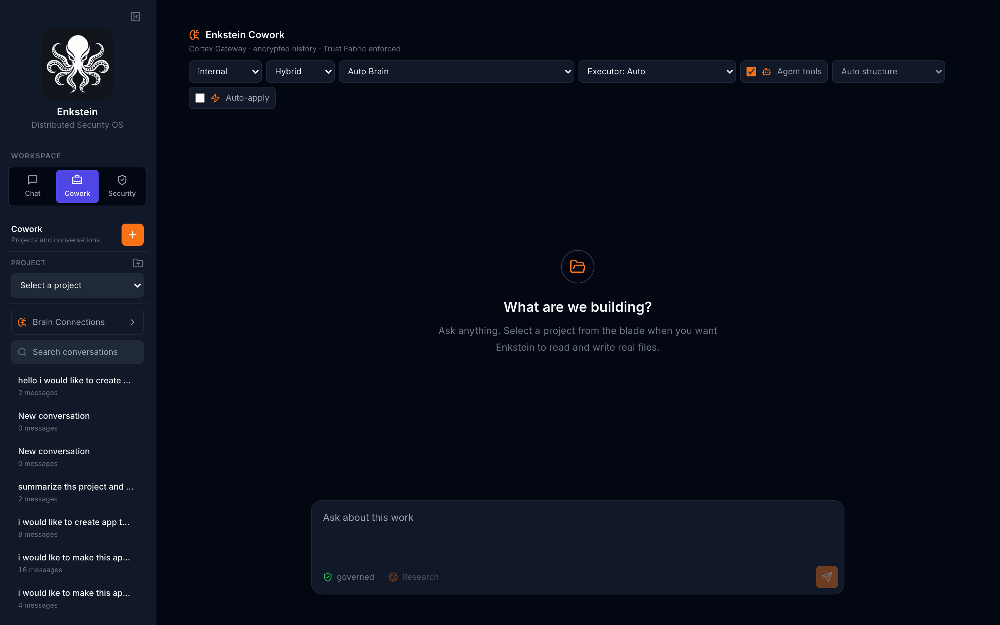
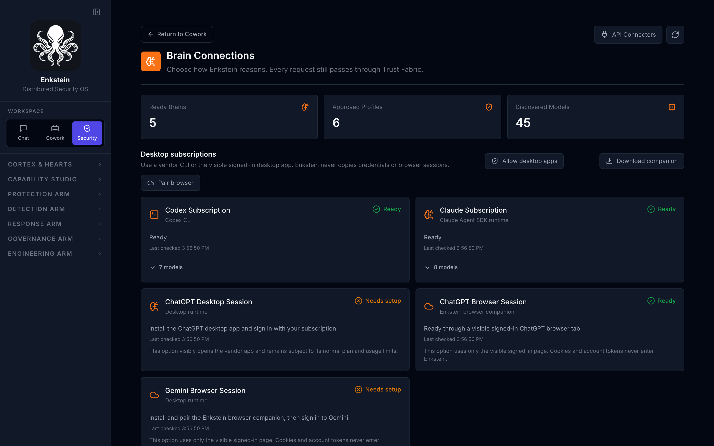
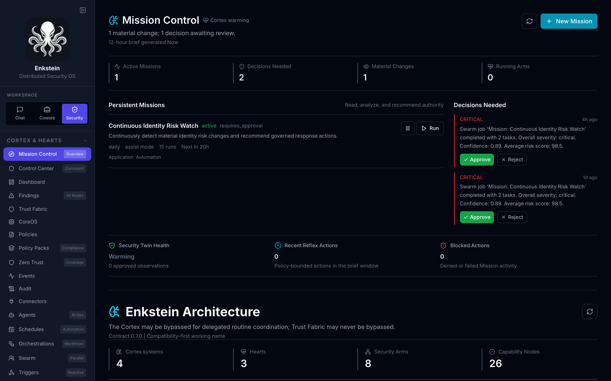
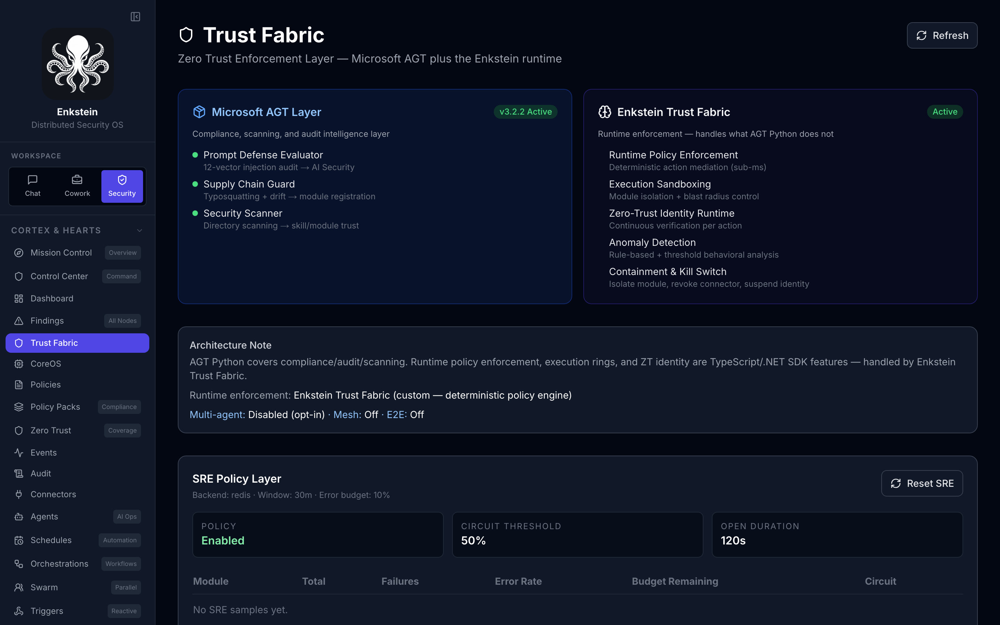
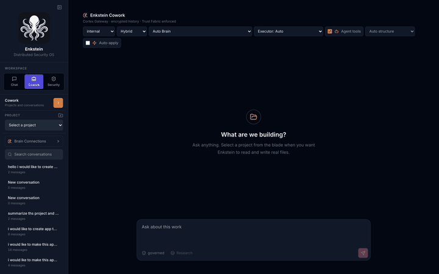
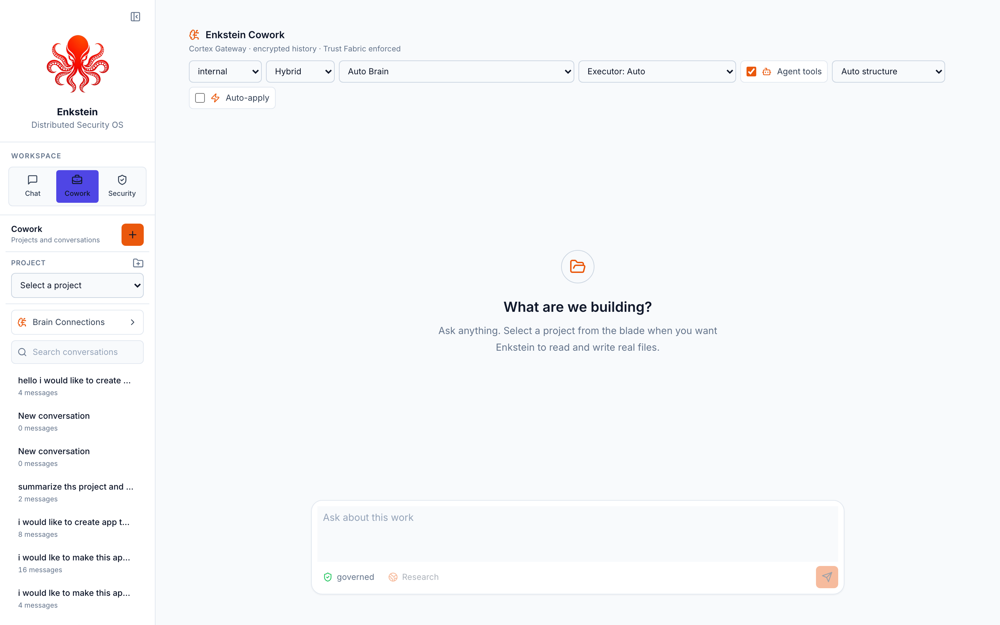
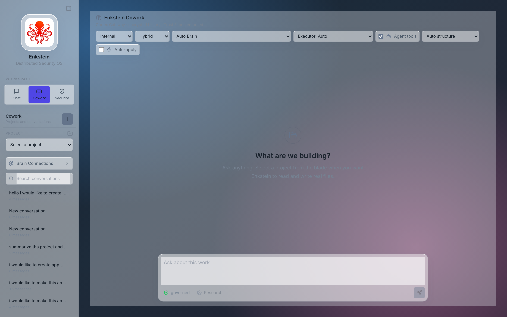

<p align="center">
  
</p>

<h1 align="center">Enkstein</h1>

<p align="center"><b>Govern every AI you use.</b></p>

<p align="center">
  Use Codex, Claude, Gemini, and local Ollama models from one open-source desktop app.<br />
  Keep sensitive work local, control which files and tools AI can touch, approve consequential<br />
  actions, and keep an audit trail of what left your machine and what did not.
</p>

<p align="center">
  <a href="https://github.com/wcoreiron-rgb/enkstein/releases/latest/download/Enkstein-0.7.0-macos.pkg">
    
  </a>
  &nbsp;
  <a href="https://github.com/wcoreiron-rgb/enkstein/releases/latest/download/Enkstein-0.7.0-windows-x64-setup.exe">
    
  </a>
</p>

<p align="center">
  <sub>
    <b>v0.7.0</b> &nbsp;&middot;&nbsp; macOS 14+ (Apple silicon &amp; Intel), signed and notarized &nbsp;&middot;&nbsp;
    Windows 10/11 x64, currently unsigned &mdash; SmartScreen shows a publisher warning &nbsp;&middot;&nbsp;
    <a href="https://github.com/wcoreiron-rgb/enkstein/releases/latest">All downloads &amp; checksums</a>
  </sub>
</p>

<h3 align="center">Before you launch</h3>

<p align="center">
  <b>Required &mdash; <a href="https://www.docker.com/products/docker-desktop/">Docker Desktop</a>.</b><br />
  <sub>Enkstein runs its governed services locally. Every launch checks Docker Desktop before starting anything, opens it when stopped, and waits for <code>docker info</code> to succeed. If Docker is missing, the official Docker installation flow opens and Enkstein keeps checking until the engine is ready. Allow 4&nbsp;GB RAM.</sub>
</p>

<p align="center">
  <b>Optional &mdash; <a href="https://ollama.com/download">Ollama</a>, for free local Brains.</b><br />
  <sub>Without it Enkstein still runs; you supply your own model access instead (Codex or Claude subscription, or an API key). With it, Chat, Cowork, and Security work offline at no cost. Enkstein discovers whatever models you have pulled.</sub>
</p>

<p align="center">
  <sub>Prefer to run it yourself? See <a href="#quick-start">Quick Start</a> for the self-hosted bundle, and the <a href="docs/testing-guide.md">Testing Guide</a> for what to try first.</sub>
</p>

---

## Enkstein is not another AI model

It is the local control plane around the models you already pay for.

Codex and Claude Code are excellent at writing code. Neither can tell you
whether a secret reached a cloud provider, which model saw your customer data,
or what an agent changed on disk while you were away. Enkstein sits in front of
them and answers those questions.

- **Route safely.** Pick models by data sensitivity, cost, and capability.
  `restricted` and `top_secret` work is pinned to local models and never leaves
  the machine.
- **Approve actions.** Bound which files, commands, and connectors an AI may
  reach. Consequential changes wait for you.
- **Verify results.** Every reply carries provenance: which model answered, what
  policy decided, what was redacted, and which files changed.

Bring your own brains — a Codex or Claude subscription, an API key, or free
local models through Ollama. Enkstein is MIT-licensed and runs entirely on your
own hardware.

<p align="center">
  
  
  
  
</p>

> [!NOTE]
> **Early preview (v0.x).** Enkstein is under active development. Security mode
> ships with **simulated findings by default** — connect your own credentials to
> enable live integrations. It has **not had an independent third-party audit**,
> so it is built for evaluation and feedback rather than unmonitored production.
> See the [Maturity Matrix](docs/maturity-matrix.md) for what is shipped versus
> in progress, and the [OWASP Agentic self-assessment](https://wcoreiron-rgb.github.io/enkstein/owasp-agentic.html).

## How it works

You point Enkstein at a project or a security question. Before any model sees
it, Enkstein classifies the data, decides which model is permitted, redacts
what should not travel, and records the decision.

1. **Chat** — governed conversation with any connected model.
2. **Cowork** — file-assisted work in a project folder you select. Answering
   models are advisors; Enkstein performs the writes, inside your approved
   folder, with a diff you approve.
3. **Security** — 25 capability areas covering cloud posture, identity,
   endpoint, threat intel, and DevSec, plus AI-specific governance like
   prompt-injection detection and DLP.

Every tool call, credential access, and remediation passes through the Trust
Fabric: policy evaluation, risk scoring, privilege tiers, human approval for
high-risk actions, and an immutable audit log. There is no ungoverned execution
path.

**The problem it solves:** how do you let AI agents do real work without handing
them unbounded power over your environment?

### First workflow: Identity Incident Mission

Enter a suspicious user or principal in **Identity Security** and start an
Identity Incident Mission. Enkstein correlates approved identity, endpoint,
cloud, log, threat, and compliance evidence; shows the source of every task as
live, recorded, demo, or unavailable; then produces a confidence, blast-radius,
ticket draft, and recommended actions. The investigation is read/analyze/
recommend only. Any session revocation, account containment, device isolation,
or ticket action remains a separate Trust Fabric approval.

By default, the mission does **not** use seeded or simulated findings. The
operator may explicitly enable labeled demo evidence for a local walkthrough.
See [Identity Incident Mission](docs/identity-incident-mission.md) for the
evidence policy, connector requirements, and action limits.

Internally the architecture is organism-inspired — a Cortex that routes, Three
Hearts for trust, memory, and execution, Security Arms, Capability Nodes, and a
peer Plexus. You do not need any of that vocabulary to use the app; see
[Architecture](docs/marcellus-architecture.md) and the
[Runtime Reference](docs/runtime-reference.md) if you want it.

## Screenshots

<table>
  <tr>
    <td width="50%"><br/><sub><b>Cowork</b> — governed file work in a project folder you select. Pick the runtime group, executor, and whether changes auto-apply or wait for approval.</sub></td>
    <td width="50%"><br/><sub><b>Brain Connections</b> — Codex, Claude, browser sessions, and local Ollama models side by side. Cookies and account tokens never enter Enkstein.</sub></td>
  </tr>
  <tr>
    <td width="50%"><br/><sub><b>Security</b> — Mission Control and the Capability Nodes, grouped into Arms that stay collapsed until you open them.</sub></td>
    <td width="50%"><br/><sub><b>Trust Fabric</b> — the policy decision behind every model call, tool invocation, and remediation, with the audit record.</sub></td>
  </tr>
</table>

> More views: [Chat](docs/screenshots/chat.png) · [Platform Overview](docs/screenshots/dashboard.png) · [Swarm](docs/screenshots/swarm.png) · [Remediation](docs/screenshots/remediation.png) · [Zero Trust coverage](docs/screenshots/zero-trust.png) · [Connectors](docs/screenshots/connectors.png)

### Product Tour

<p align="center">
  <a href="docs/demo/enkstein-tour.webm">
    
  </a>
</p>

<p align="center"><sub>Click the preview to watch the full tour.</sub></p>

### Themes

<table>
  <tr>
    <td width="50%"><br/><sub><b>Light</b> — a clean opaque workspace for long sessions and bright environments.</sub></td>
    <td width="50%"><br/><sub><b>Liquid Glass</b> — a translucent native-material workspace. This web capture uses a representative backdrop; the desktop app composites your own wallpaper behind it.</sub></td>
  </tr>
</table>

The theme picker is in the sidebar footer: Dark, Light, and Liquid Glass.

## How Enkstein Compares

Enkstein sits at the intersection of three tool categories — and is the only one that delivers all of it under one governed roof. Each category below has real strengths (shown honestly); the gap Enkstein fills is **governance + intelligence + security-domain coverage together.**

| Capability | Raw LLM Agents<br/><sub>(AutoGPT-style)</sub> | Agent Frameworks<br/><sub>(LangChain etc.)</sub> | Traditional SOAR<br/><sub>(playbook engines)</sub> | **Enkstein** |
|---|:---:|:---:|:---:|:---:|
| Autonomous AI investigation & reasoning | ✅ | ✅ | ❌ rigid scripts | ✅ Copilot + multi-agent swarms |
| Per-action policy enforcement | ❌ | ❌ build it yourself | ~ static rules | ✅ Trust Fabric on **every** action |
| Continuous risk scoring (action / session / device) | ❌ | ❌ | ~ | ✅ |
| Execution privilege isolation | ❌ | ❌ | ❌ | ✅ 4-tier ring policy |
| Human-in-the-loop approval gates | ❌ | ~ DIY | ✅ | ✅ dual-approval, self-approval blocked |
| Immutable audit of every agent action | ❌ | ❌ | ~ | ✅ |
| AI-specific governance (prompt injection, DLP) | ❌ | ❌ | ❌ | ✅ 12-vector AGT audit |
| Security domain coverage out of the box | ❌ | ❌ | ~ via connectors | ✅ 25 capability nodes |
| Governed multi-agent orchestration | ~ | ~ | ❌ | ✅ swarms w/ judge + approval |
| Self-hosted · bring-your-own-keys | ~ | ✅ | ~ | ✅ |

<sub>✅ native · ~ partial / depends on configuration · ❌ not available. Categories represent common tooling patterns, not specific vendors. This is a vendor self-assessment — see the [OWASP Agentic self-assessment](https://wcoreiron-rgb.github.io/enkstein/owasp-agentic.html) and [Maturity Matrix](docs/maturity-matrix.md) for evidence of what's shipped vs. in progress.</sub>

**In one line:** an agent framework gives you *capability*, a SOAR gives you *process*, Enkstein gives you **autonomous capability that is governed by default.**

## Architecture

```
Enkstein/
├── backend/           FastAPI — CoreOS, Trust Fabric, AI Security, Identity Security
├── frontend/          Next.js — Platform UI dashboard
├── docker-compose.yml Full local stack
```

Deeper reading:

- [Architecture](docs/marcellus-architecture.md) — the Cortex, Hearts, Arms, and Plexus model.
- [Runtime Reference](docs/runtime-reference.md) — Missions, Reflexes, Regeneration, Brain runtime groups, and Brain Bridges.
- [Maturity Matrix](docs/maturity-matrix.md) — what is shipped versus in progress.
- [Testing Guide](docs/testing-guide.md) — which connectors work without a paid account.

## Security Compliance

Enkstein maintains an honest, evidence-backed self-assessment against the **OWASP Top 10 for LLM/Agentic AI Applications (2025)**.

| Document | Format |
|---|---|
| [OWASP Evidence Matrix (Interactive)](https://wcoreiron-rgb.github.io/enkstein/owasp-agentic.html) | Interactive HTML |
| [LLM Top 10 Mapping (Markdown)](docs/owasp-agentic-mapping.md) | Markdown |
| [Agentic ASI Top 10 Mapping (Markdown)](docs/owasp-asi-mapping.md) | Markdown |
| [Platform Maturity Matrix (Markdown)](docs/maturity-matrix.md) | Markdown |
| [Production Deployment Guide](docs/production-deployment.md) | Markdown |

**Current posture (2026-05-31):**

| Category | Status |
|---|---|
| LLM01 Prompt Injection | Shipped — 12-vector AGT audit on every AI event |
| LLM02 Insecure Output Handling | Shipped — prompt scanning, model-output re-scan/redaction, and DLP scanning of provider-generated binary downloads (OOXML/ZIP members included) before any file is written |
| LLM03 Training Data Poisoning | N/A — uses provider APIs, no training pipeline |
| LLM04 Model Denial of Service | Shipped — auth and model-router per-IP limits, plus per-identity rate limiting on governed Cowork/Chat turn, stream, and research endpoints; token-budget quotas remain planned |
| LLM05 Supply-Chain Vulnerabilities | In Progress — encrypted credentials, pinned deps, AGT supply-chain scan + exchange checksum gate, CI SBOM + blocking dependency policy thresholds |
| LLM06 Sensitive Information Disclosure | Shipped — Fernet encryption, DLP scanner, masked credential hints |
| LLM07 Insecure Plugin Design | Partially Shipped — ring policy + SSRF protection shipped; OS sandbox not yet |
| LLM08 Excessive Agency | Shipped — 4-ring privilege isolation, dual-approval gates, self-approval blocked |
| LLM09 Overreliance | Shipped — override usage captured in routing audit, and lowering a detected data classification is refused without a recorded justification |
| LLM10 Model Theft | N/A — no hosted weights; API keys encrypted at rest |

> This is a vendor self-assessment. Independent audit recommended before compliance reliance.

Supply-chain policy gating supports a temporary time-boxed waiver baseline at `security/supply_chain_baseline.json` so CI blocks on net-new risk while legacy debt is being burned down.

Compliance Assurance now exposes a Trust Fabric-governed evidence bundle export at `POST /api/v1/complianceclaw/evidence/export`, including findings, compliance-relevant audit logs, framework rollups, and a SHA-256 chain-of-custody hash.

## Quick Start

> **Evaluating Enkstein or testing connectors?** Start with the
> [Testing Guide](docs/testing-guide.md). It lists which connectors work
> without a paid account, what a passing connector test does and does not
> prove, how to tell live findings from demonstration data, and the gaps worth
> knowing before you file an issue.

### Download a release package

The easiest installation path is a versioned bundle from
[GitHub Releases](https://github.com/wcoreiron-rgb/enkstein/releases). Each
release includes `.tar.gz` and `.zip` self-hosted bundles, Python package
artifacts, and `SHA256SUMS` integrity checks.

```bash
tar -xzf enkstein-VERSION.tar.gz
cd enkstein-VERSION
./install.sh
```

The installer validates Docker Compose, creates a private `.env` with unique
random secrets, builds the containers, and starts Enkstein. It never
overwrites an existing `.env`. See [installation details](docs/installation.md).

### One-click desktop installers

GitHub Releases also provide native launchers:

- **macOS:** install `Enkstein-VERSION-macos.pkg`; setup creates
  `/Applications/Enkstein.app` and launches a native Intel/Apple Silicon
  desktop window after installation.
- **Windows x64:** run `Enkstein-VERSION-windows-x64-setup.exe`; setup creates
  Start Menu and optional desktop shortcuts and launches `Enkstein.exe`.

Both launchers start Docker Desktop when necessary, generate unique local
secrets, and start the Enkstein services. The macOS app displays startup
progress, waits for the Cortex and UI health checks, and embeds the governed UI
inside its own WebKit window instead of opening the browser. Docker Desktop is
still required, and the first launch can take several minutes while local
images build. Connector credentials are added afterward through the Connectors
UI and remain encrypted in persistent local volumes. See
[native installer details](docs/native-installers.md).

### Local owner authentication and background runtime

The first desktop launch requires creation of a local owner password and TOTP
enrollment with an RFC-compatible Authenticator application. Enkstein displays
the QR secret only during enrollment and returns ten one-time recovery codes.
Later owner sessions require both the password and current Authenticator code;
email-code viewer access remains optional after an Email/SMTP connector is
configured.

The operator console locks after 30 minutes without interaction. Locking,
closing, or quitting the console does not stop the Compose runtime: monitoring,
schedules, active Swarms, and policy-authorized Reflexes continue, while actions
that require human approval remain queued. On macOS, the menu-bar control can
reopen or lock the console. Authentication endpoints are under
`/api/v1/auth/owner/*`; TOTP secrets and recovery-code hashes are encrypted in
the persistent local secret volume.

### Prerequisites
- Docker + Docker Compose installed
- 4GB RAM available

### Run locally

```bash
cd enkstein
docker-compose up --build
```

Then open:
- **Frontend UI**: http://localhost:3000
- **API Docs**: http://localhost:8000/docs
- **Health check**: http://localhost:8000/health

The Docker frontend runs as a production Next.js server. The image builds the UI with `npm run build`, starts it with `npm run start`, and proxies browser `/api/v1/*` calls to `http://backend:8000` inside Docker.

### First steps after launch

1. Open http://localhost:3000/dashboard
2. Go to **Connectors** → click any connector → enter your own API credentials
   - Credentials are encrypted at rest (Fernet AES-128) and never stored in plaintext
   - Each deployment auto-generates its own encryption key in `backend/.secrets/` (gitignored)
3. Go to **Policies** → add preset policies (Block Shell Execution, etc.)
4. Go to **AI Security** → submit a test prompt (try including an API key to test detection)
5. Watch the **Events** and **Audit** log populate
6. Go to **Identity Security** → check identity inventory

> **Security note:** Never commit `backend/.secrets/` — it contains your encryption key and stored credentials. This directory is gitignored by default. Each deployer gets their own isolated key.

### Connecting your own tools

Every Capability Node module supports real integrations. Go to **Connectors** and add credentials for the tools you use:

| Category | Supported integrations |
|---|---|
| Cloud | AWS (Security Hub), Azure (Defender), GCP (Security Command Center) |
| Cloud posture | Prowler CLI (read-only AWS, Azure, GCP, Kubernetes, and GitHub checks) |
| Endpoint | CrowdStrike Falcon, Microsoft Defender for Endpoint, SentinelOne |
| Identity | Okta, Microsoft Entra ID, AWS IAM |
| AI/LLM | Anthropic, OpenAI, Azure OpenAI, Ollama (local) |
| Code | GitHub (secret scanning, code review) |
| Log/SIEM | Splunk |
| Custom | Any REST API via Custom Capability |

Without credentials, all modules run on realistic simulated findings so the platform is fully usable for demos and evaluation.

Every finding records a **data origin** so the two are never confused once you connect a real
connector. Findings are labelled `live` (returned by an authenticated provider, with the source
connector named), `simulated` (locally generated demonstration data), or `unknown`. An adapter
that supplies no origin is recorded as `unknown` rather than `live`, so nothing can be presented
as verified estate data by omission. Filter with `GET /api/v1/findings?data_origin=live`, or use
the data-origin filter in the Findings console.

Prowler ships inside the backend image in its own virtual environment, so its dependency tree cannot collide with
the backend's pinned requirements. Register the Prowler Cloud Posture connector, choose a provider, and run
Cloud Security. Enkstein invokes Prowler without a shell, passes cloud secrets through the child environment rather
than command arguments, caps execution time and output, and labels results with a stable Prowler control ID. A
missing executable or failed run is reported honestly; demonstration findings are not substituted for a failed scan.

### Zero Trust control plane

Enkstein measures posture against a control catalog of 1,426 controls: 324 from the NIST SP 800-53 Rev 5 OSCAL
catalog, 1,038 from Prowler's AWS/Azure/GCP/Kubernetes/GitHub checks, and 64 authored for Capability Nodes.
Controls are grouped by CISA Zero Trust Maturity Model pillar and retain their source, version, automation state,
and remediation metadata.

Each Security Arm carries its own tailored profile rather than sharing one flat pool, so its coverage percentage is
measured against controls it can actually produce evidence for. A control passes only when a collector ran and
returned no violation: silence is never success, demonstration data never produces a verdict, and stale evidence
downgrades to NOT ASSESSED. Failing controls propose the remediation they declare through the governed remediation
engine, which keeps its own risk classification and approval gate.

See [Zero Trust controls](docs/zero-trust-controls.md) for the full API surface and verdict rules.

### Which Capability Nodes return live data

Seven nodes call a provider API when a connector is configured: **Cloud Posture** (AWS Security
Hub, Azure Defender for Cloud, GCP SCC), **Endpoint** (CrowdStrike, Defender, SentinelOne),
**Developer Security** (GitHub), **Identity** and **Privileged Access** (Entra ID, Okta),
**Security Telemetry** (Splunk), and **AI Governance**.

The remaining nodes are connector-aware but not yet adapter-backed. Configuring a connector for
one of them does not empty it: it keeps showing demonstration findings with the `simulated`
badge and reports `"Connector configured, but no live adapter is available yet"` in the scan
response, so a configured-but-inert connector is never mistaken for a broken scan.

### Connecting Microsoft without an app registration

Entra ID, Azure, Defender, and Sentinel connectors support **interactive sign-in** using the
OAuth device authorization grant. Enkstein shows a code, you approve it once on Microsoft's own
sign-in page, and Enkstein receives a refresh token — no app registration and no client secret.
Access tokens renew automatically so scheduled scans keep working.

This is a documented provider flow, not browser-session reuse: no cookies, page automation, or
vendor session tokens are involved, and you can revoke the grant from Microsoft's consent screen
at any time. Device sign-in passes the same Trust Fabric policy gate as manual credential entry.

GitHub device sign-in requires your own OAuth app; set `GITHUB_OAUTH_CLIENT_ID` to enable it.
Every other connector continues to use credential configuration, because `client_credentials`
with a scoped app registration is the correct posture for unattended scanning.

## Use it from your terminal & editor

Enkstein ships in three installable forms beyond the web platform. All three talk to your running Enkstein server, so the **Trust Fabric governs every call** — policy, risk scoring, and audit apply server-side.

### ⚡ Add Enkstein to Cursor in 30 seconds (MCP)

Let the AI agent in your editor call governed security tools — scan code for secrets, check posture, launch investigations.

```bash
pip install ./enkstein_mcp-0.7.0-py3-none-any.whl
```

Add to `~/.cursor/mcp.json` (or your Claude Desktop / VS Code MCP config):

```json
{
  "mcpServers": {
    "enkstein": {
      "command": "enkstein-mcp",
      "env": { "ENKSTEIN_API_URL": "http://localhost:8000" }
    }
  }
}
```

Restart Cursor, then just ask:

> *"Scan the file I have open for hardcoded secrets."*
> *"What's my current security posture?"*
> *"Investigate suspicious identity activity for user@corp.com."*

Tools exposed: `scan_text_for_secrets` · `get_security_posture` · `list_findings` · `list_connectors` · `run_swarm_investigation` · `terraclaw_generate_secure_terraform` · `terraclaw_review_hcl` · `terraclaw_analyze_plan`. → [full MCP docs](mcp-server/README.md)

### 🖥️ CLI — drive the platform from your shell

```bash
pip install ./enkstein_cli-0.7.0-py3-none-any.whl
export ENKSTEIN_API_URL=http://localhost:8000
enkstein status dashboard
enkstein connectors test okta
enkstein evidence collect --framework soc2
```
→ [full CLI docs](cli/README.md)

### 🧩 Embed the governance core (no server)

Drop Enkstein's enforcement primitives into your own scripts, agents, or pre-commit hooks — runs in-process, only depends on `cryptography`.

```bash
pip install ./enkstein_core-0.7.0-py3-none-any.whl
```
```python
from enkstein_core import classify_ring, evaluate_ring, scan_text, verify_package
```
→ [full core docs](enkstein-core/README.md)

## API Reference

Full interactive docs at: http://localhost:8000/docs

Key endpoints:

| Method | Path | Description |
|--------|------|-------------|
| GET | /api/v1/dashboard | Platform stats |
| POST | /api/v1/arcclaw/events | Submit AI event for inspection |
| GET | /api/v1/arcclaw/stats | AI Security risk summary |
| GET | /api/v1/identityclaw/identities | Identity inventory |
| GET | /api/v1/identityclaw/orphaned | Orphaned identities |
| GET | /api/v1/policies | List policies |
| POST | /api/v1/policies | Create policy |
| GET | /api/v1/events | All events |
| GET | /api/v1/events/anomalies | Anomalies only |
| GET | /api/v1/audit | Audit log |
| POST | /api/v1/remediation/trigger | Trigger a remediation playbook/action |
| POST | /api/v1/remediation/actions/{id}/approve | Approve a queued remediation action |
| POST | /api/v1/swarm/jobs | Launch a multi-agent swarm investigation |
| POST | /api/v1/exec/shell | Submit a governed shell command (ring + dual-approval) |
| POST | /api/v1/channel-gateway/message | Ingest a command from Slack/Teams/webhook |
| POST | /api/v1/remote-agents/register | Register a remote/edge agent |
| POST | /api/v1/skill-packs/{id}/install | Provenance-verified skill pack install |
| GET | /api/v1/trust-fabric/containment-probe | Trust Fabric containment self-test |

## Security Design Principles

1. **Every component has identity** — No anonymous modules or connectors
2. **Every action is authorized** — Policy evaluated before execution
3. **Every runtime is monitored** — Behavior tracked, not just access
4. **Every workflow is attributable** — Maps to a human owner
5. **Every risk is containable** — Isolation, revocation, kill switch
6. **Every module is governed** — Plug-and-play = plug-and-governed

## AGT + Multi-Agent Governance

Enkstein exposes AGT rollout through a provider boundary instead of direct Capability Node coupling:

- Adapter boundary: `backend/app/fabric/providers/agt/`
- Feature flags (opt-in): `AGT_ENABLE_MCP_GATEWAY`, `AGT_ENABLE_E2E_MESSAGING`, `AGT_ENABLE_AGENT_MESH`, `AGT_ENABLE_SHADOW_DISCOVERY`
- Trust Fabric APIs:
  - `GET /api/v1/trust-fabric/multi-agent/status`
  - `POST /api/v1/trust-fabric/mcp/scan`

See the [agent workflow guide](docs/agent-workflow.md) for operational guidance.

## Release History

Enkstein ships versioned macOS packages and self-hosted bundles. The
authoritative, per-release record of what changed — including the root cause
behind each fix — lives in two places:

- [Changelog](docs/changelog.html) — every released version, newest first.
- [GitHub Releases](https://github.com/wcoreiron-rgb/enkstein/releases) — downloadable installers and `SHA256SUMS`.

For where the platform is strong versus still maturing, see the
[Maturity Matrix](docs/maturity-matrix.md) and the *Known gaps* section of the
[Testing Guide](docs/testing-guide.md).

## Platform Modules (25 Capability Nodes + 4 Core Surfaces + Core Engines)

### Security Domain Capability Nodes (25)

| Module | Description |
|--------|-------------|
| 🤖 AI Security | AI & LLM Security — prompt injection detection (12-vector AGT audit), NVIDIA NIM, Claude, OpenAI, Ollama |
| 🪪 Identity Security | Identity Governance — human & non-human identity risk scoring, Okta, Entra ID |
| ☁️ Cloud Security | Cloud Security Posture — AWS, Azure, GCP, real-time findings |
| 🌐 Exposure Management | External Attack Surface Management — CVE lookup, CISA KEV, MITRE ATT&CK |
| 🛡️ Endpoint Security | EDR — CrowdStrike, Defender, SentinelOne, quarantine/unquarantine |
| 🔍 Threat Analysis | Threat Intelligence & Detection — MITRE ATT&CK mapping, automated triage |
| 📋 Security Telemetry | Log Management & SIEM coverage |
| 🌉 Network Security | Network Security & segmentation — Palo Alto, Fortinet, Cisco |
| 🔑 Privileged Access | Access Control & IAM governance — Okta, Entra ID, CyberArk |
| 🗂️ Data Security | Data Loss Prevention — Varonis, Purview, Macie |
| 📱 Application Security | Application Security — SAST, SCA, Snyk, Veracode |
| ☁️ SaaS Security | SaaS Security Posture Management — Netskope, Zscaler |
| ⚙️ Configuration Security | Configuration Compliance — AWS Config, Azure Policy |
| 🧱 Terraform Governance | Terraform & IaC Security Governance — chat-style secure generation, Terraform MCP tools, HCL review, plan risk analysis, GCP Cloud SQL/Azure/AWS templates, Terraform Cloud, tfsec/Trivy, Checkov, Infracost |
| ✅ Compliance Assurance | SOC2, PCI-DSS, ISO 27001, HIPAA, GDPR, CIS — control mappings + evidence |
| 🔒 Privacy Governance | Privacy & GDPR enforcement — OneTrust, TrustArc |
| 🏢 Vendor Risk | Third-Party & Supply Chain Risk — BitSight, SecurityScorecard |
| 👤 User Risk | User Behavior Analytics — UEBA, anomaly detection |
| 🔎 Insider Risk | Insider Threat Detection — Proofpoint, Purview |
| ⚡ Security Automation | Automation & CI/CD Security — ServiceNow, Jira, SOAR |
| 🗺️ Attack Path Analysis | Attack Path Analysis — XM Cyber, Orca, Tenable |
| 💻 Developer Security | DevSecOps & Secret Scanning — GitHub Advanced Security, Snyk |
| 🧠 Threat Intelligence | Threat Intelligence Feeds — Recorded Future, MISP |
| 🔄 Recovery Readiness | Incident Recovery & Runbooks — Veeam, Rubrik |
| 🔌 Custom Capability | User-defined REST API integrations — no-code builder |

### New Core Platform Surfaces (4)

| Module | Description |
|--------|-------------|
| 🧩 Model Cortex | AI Model Governance — policy-governed model routing, tenant-scoped profiles, call audit, Model Cortex Judge synthesis |
| ⚡ Command | Multi-channel Command Ingestion — Teams, Slack, webhook, email, CLI → unified policy-governed command contract with multi-operator approval |
| 🎛️ Control Center | Unified operator cockpit — commands, approvals, swarms, remote agents, channel pressure, execution gates |
| 🚀 Release Governance | Zero Trust Deployment Governance — preflight CI/CD, GitOps, cloud SDK/CLI, script, full-stack, and AI-stack deployments before execution handoff |

### Platform Engines (always-on)

| Engine | Description |
|--------|-------------|
| 🛡️ Trust Fabric | Central zero-trust enforcement — policy eval, risk scoring, audit for every action |
| 🔄 Swarm Orchestration | Multi-agent parallel investigation — planner, dispatcher, judge, SSE stream, ticket handoff |
| 🚨 Autonomous Remediation | Finding → playbook → action → approval gate → rollback. 5 built-in playbooks, 4 provider integrations |
| 💍 Ring Policy | 4-tier execution isolation (ring0 blocked → ring3 auto-allow). Deterministic `execution_ring_violation` deny |
| 📡 Channel Gateway | Multi-channel ingress normalization with approval workflow, bulk review, timeline audit |
| 🔐 External Agent Control | Remote agent registration, heartbeat, dispatch, tenant enforcement, kill-switch |
| 📦 Skill Pack Exchange | Signed marketplace for skills, policies, playbooks — provenance-verified install plus preview/upgrade/rollback lifecycle APIs |
| 🏥 SRE Engine | Circuit breaker, error budget, SLO enforcement for all governed modules |
| 🖥️ Governed Exec Channels | Shell / browser / credential execution behind dual-approval, ring policy, and fail-closed Trust Fabric gating |
| 🛰️ Remote Control | Remote/edge agent registration, heartbeat, command dispatch, tenant scoping, and kill-switch |
| 🚀 Release Governance | Deployment request → Release Governance preflight → Trust Fabric decision → approval/execute handoff → chain-of-custody evidence |

### Skill Pack Exchange Lifecycle

The Skill Pack API now supports governed install and lifecycle operations without a migration by preserving rollback snapshots in pack manifest metadata.

| Endpoint | Purpose |
|----------|---------|
| `POST /api/v1/skill-packs/{id}/install` | Trust Fabric-governed install with optional AGT MCP gateway `scan_path` enforcement |
| `POST /api/v1/skill-packs/{id}/preview-update` | Shows skills, connectors, Capability Nodes, and scope-permission diff before upgrade |
| `POST /api/v1/skill-packs/{id}/upgrade` | Upgrades an installed pack and stores a bounded previous-version snapshot |
| `POST /api/v1/skill-packs/{id}/rollback` | Restores the latest previous version and records rollback actor/reason metadata |

The Skill Packs UI now exposes the same lifecycle controls: optional gateway `scan_path` on install, update preview diff, installed-pack upgrade, rollback availability, and rollback execution.

## Tech Stack

- **Backend**: FastAPI + SQLAlchemy (async) + PostgreSQL + Redis
- **Frontend**: Next.js 14 + TypeScript + Tailwind CSS
- **Infra**: Docker Compose

## Development

### Backend only
```bash
cd backend
pip install -r requirements.txt
uvicorn main:app --reload
```

### Frontend only
```bash
cd frontend
npm install
npm run dev
```
